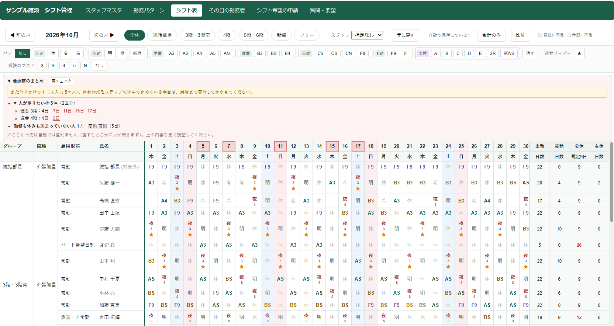
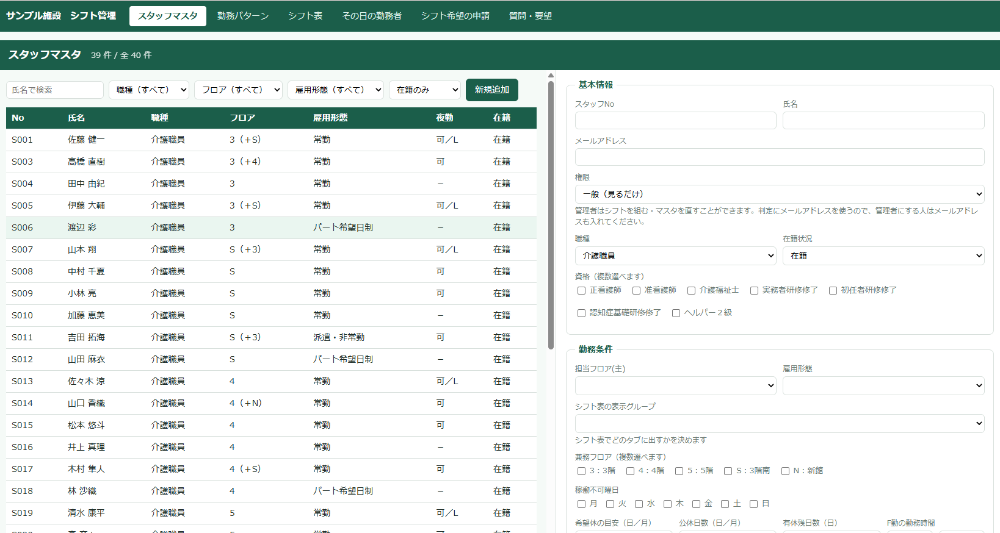
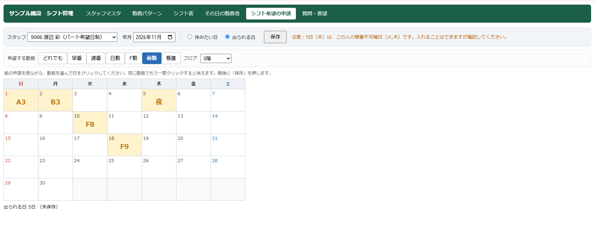

# 介護施設向けシフト管理アプリ（Google Apps Script）

介護施設の介護職員向けに作った、月単位のシフト管理Webアプリです。
Googleスプレッドシートをデータベースにして、Google Apps Script（GAS）で画面と処理を作っています。
サーバーや有料ツールは不要で、Googleアカウントがあれば動きます。

もともとは、ある介護老人保健施設（老健）の現場で、シフトを組む人（副主任）に聞き取りをしながら作りました。
その後、フロアの構成や公休の日数などを**スプレッドシートの設定で変えられる形（汎用版）**に作り直し、ほかの施設でも使えるようにしています。
公開版では、施設名を「サンプル施設」に、スタッフをすべて架空のサンプルデータにしています。

## 現場の課題（元になった施設の例）

- 1か月分のシフトを、フロアごとの副主任がExcelで叩き台を作り、持ち寄って調整するのに約1週間かかっていた
- フロアと勤務時間帯（早番・遅番・日勤・夜勤など）を1つの記号で表す独自ルールがある
- 公休の日数（月9日、2月は8日）、希望休の上限（月3日）、夜勤明けの扱いなど、守るべきルールが多い
- 希望休は紙に書いて提出しており、集計が手作業だった

## 主な機能

| 機能 | 内容 |
|---|---|
| シフト表 | 1か月単位の表（横に日付、縦にスタッフ）。グループ別タブと全体タブ、日ごとの人数集計、人数不足の警告、印刷 |
| シフトの自動作成 | 希望休・出勤希望・夜勤回数の上限・連勤の上限・夜勤リーダーの有無・優先順位などを考慮して1か月分を組む。**公休の規定日数を夜勤より優先**して確保する。組めなかった枠は「要調整」として一覧表示 |
| シフト希望の申請 | 希望休（休みたい日）と出勤希望（出られる日と勤務）をカレンダーで入力。副主任の代行入力にも対応 |
| 有給の管理 | 有給の申請と残日数の管理。残日数を超えた場合は要調整に表示 |
| スタッフマスタ | 雇用形態・担当フロア（主担当＋兼務）・夜勤可否・稼働不可曜日・希望休上限・公休日数・優先順位などを画面から登録 |
| 勤務パターンマスタ | 勤務記号ごとの時間帯・対象フロア・「日をまたぐ」などのフラグを画面から登録 |
| その日の勤務者 | 指定した日に誰がどの勤務に入っているかを一覧表示 |
| 質問・要望 | 利用者からの質問・要望を受け付けて記録し、管理者にメールで知らせる |
| 権限 | 管理者（副主任・部長）と一般スタッフの2段階。一般スタッフはシフト表の閲覧などに限定 |

## 施設ごとに変えられること（シートの設定）

施設ごとに違う部分は、プログラムを直さずにスプレッドシートのシートで変えられます。

| シート | 設定できること |
|---|---|
| `floor` | フロアの一覧。記号・名称・並び順・別名（入力のゆれ）・グループ（シフト表のタブのまとまり）・夜勤リーダーを置くか・略称 |
| `holiday` | 月ごとの公休の規定日数（1月〜12月） |
| `setting` | 施設名（画面と印刷に表示）、質問・要望のメール送り先 |
| `pattern` / `symbol` | 勤務記号と時間帯、対象フロア |
| `staffing` | 時間帯ごとの必要人数（最低・希望） |
| `staff` | スタッフごとの条件（公休日数を個別に変える場合もここ） |

`floor` シートの列は次のとおりです（1行目は見出し）。

| 列 | 内容 | 例 |
|---|---|---|
| A | フロア記号（介護） | 3 |
| B | フロア記号（看護など別表記） | 3 |
| C | 名称 | 3階 |
| D | 並び順 | 1 |
| E | 別名（カンマ区切り） | 3F,三階 |
| F | グループ | 3階・3階南 |
| G | 夜勤リーダーを置く（チェックボックス） | ✓ |
| H | 略称（その日の勤務者画面の見出し） | 3F |

`floor` シートや `holiday` シートが無い場合は、元の施設の値（公休は30日以上の月が9日、それ以外が8日）で動きます。

## 画面

### シフト表（1か月単位・自動作成の「要調整のまとめ」つき）

### スタッフマスタ（一覧と編集フォーム）

### シフト希望の申請（出られる日と勤務をカレンダーで選ぶ）

※画面はすべてサンプルデータです。

## 設計で工夫した点

1. **施設ごとの違いをデータ（シート）で持つ**
   フロアの構成、公休日数、勤務記号・時間帯・対象フロアをコードに書かず、シートで管理しています。施設が変わってもコードの修正は不要です。
2. **自動作成は「絶対ルール」と「点数」の2段構え**
   公休日数・夜勤明けなどの絶対に守るルールを先に適用し、そのうえで回数の偏り・主担当フロア・優先順位・本人の希望を点数化して割り当てています。
3. **公休を夜勤より優先する**
   夜勤1回で「夜・明」の2日を使うため、夜勤の回数は「公休の規定日数が必ず残る回数」までに自動で抑えています。
4. **出勤希望は優先順位より先に置く**
   パート職員の「この日はこの勤務なら出られる」を確実に反映するため、点数計算の前に希望どおりの勤務を置く作りにしています。
5. **最後は人が決める**
   自動で埋まらなかった枠は「要調整」として名前つきで一覧に出し、クリックするとその人の行に移動します。
6. **入力の負担を減らす**
   2択の項目はチェックボックス、選択肢はプルダウンにして、手入力を減らしています。

## ファイル構成

| ファイル | 役割 |
|---|---|
| `src/StaffMaster.gs` | Webアプリの入口（doGet）、メニュー、権限判定、スタッフマスタの保存・読み込み、フロア・公休日数などの設定の読み込み |
| `src/PatternMaster.gs` | 勤務パターンマスタの保存・読み込み |
| `src/ShiftTable.gs` | シフト表の読み書き、人数集計、自動作成、申請・有給の処理 |
| `src/Feedback.gs` | 質問・要望の保存とメール通知 |
| `src/SampleStaff.gs` | 動作確認用のサンプルスタッフ40人を作る |
| `src/コード.gs` | シートの初期作成 |
| `src/staff.html` | スタッフマスタ画面 |
| `src/pattern.html` | 勤務パターンマスタ画面 |
| `src/shift.html` | シフト表画面 |
| `src/request.html` | シフト希望・有給の申請画面 |
| `src/autobuild.html` | 自動作成の設定ダイアログ |
| `src/dayboard.html` | その日の勤務者画面 |
| `src/feedback.html` | 質問・要望画面 |

## 使用技術

- Google Apps Script（HtmlService、SpreadsheetApp、MailApp）
- HTML / CSS / JavaScript（画面）
- Googleスプレッドシート（データ保存）

## 試し方

1. 新しいGoogleスプレッドシートを作り、「拡張機能 → Apps Script」を開きます。
2. `src` フォルダの各ファイルを、同じ名前で作って中身を貼り付けます（`.gs` はスクリプト、`.html` はHTMLとして追加）。
3. スプレッドシートを開き直すと「シフト管理」メニューが出ます。
4. メニューの【初回】【確認用】の項目で、シートとサンプルデータを作ります。
5. 必要に応じて `floor` / `holiday` / `setting` シートを作り、施設に合わせて値を入れます（上の「施設ごとに変えられること」を参照）。
6. 「デプロイ → 新しいデプロイ → ウェブアプリ」で公開すると、ブラウザやスマホから使えます。

管理者用のWebアプリを別に公開する場合は、`src/ShiftTable.gs` の `ADMIN_WEBAPP_URL` にそのURLを入れてください（公開版では空欄です）。

## 導入について

施設ごとのフロア構成・勤務記号・公休日数などの設定と、導入作業のご相談をお受けしています。

## 開発について

要件の聞き取り・設計・テスト仕様書の作成・テストを行い、実装はClaude Code（AI）を活用して進めました。

## ライセンス

MIT License
